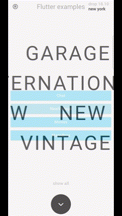

# Flutter Examples

<table align="center">
    <tr>
        <td style='background-color:#000'>
        
1

            
        </td>
        <td style='background-color:#000'>
        
2

            
        </td>
        <td style='background-color:#000'>
        
3

            
        </td>        
    </tr>
    <tr>
        <td style='background-color:#000'>
        
4

            
        </td>
        <td style='background-color:#000'>
        
5

            
        </td>
    </tr>
</table>

## Credits

The examples were inspired from various projects

* Example 3 [MUDIDEV](https://twitter.com/midudev)
* Example 4 [DIVZ](https://github.com/lewhunt/divz)
